```
 _                                                            _
| | ___  __ _ _ __ _ __         ___  _ __   ___ _ __         ___ ___   __| | ___
| |/ _ \/ _` | '__| '_ \ ___  / _ \| '_ \ / _ \ '_ \ ___  / __/ _ \ / _` |/ _ \
| |  __/ (_| | |  | | | |___|| (_) | |_) |  __/ | | |___| | (_| (_) | (_| |  __/
|_|\___|\__,_|_|  |_| |_|     \___/| .__/ \___|_| |_|      \___\___/ \__,_|\___|
                                    |_|
```

# 深入 OpenCode 源码 — 12 课拆解开源 AI 编程 Agent

> **"开源的 AI 编程 Agent — 100% 开放、模型无关、终端优先。"**

**OpenCode** ([github.com/anomalyco/opencode](https://github.com/anomalyco/opencode)) 是一个开源的 AI 编程代理 CLI 工具，用 TypeScript 构建，基于 [Vercel AI SDK](https://sdk.vercel.ai)，支持 20+ 模型供应商。它是 Claude Code 的开源替代品。

本项目灵感来自 [learn-claude-code](https://github.com/shareAI-lab/learn-claude-code)，通过逐模块拆解源码的方式，带你深入理解一个生产级 AI 编程 Agent 的架构设计。

---

## 🏗️ 架构总览

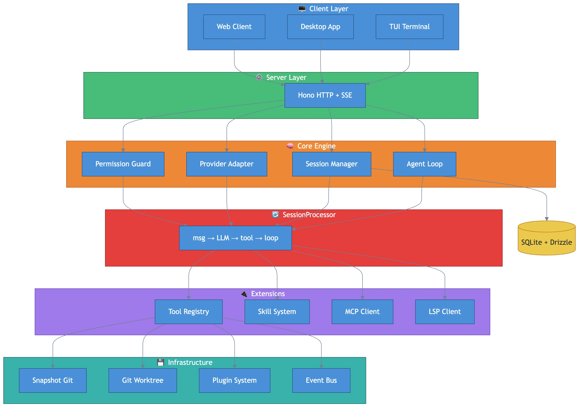

```
┌─────────────────────────────────────────────────────────────────┐
│                         CLI / Desktop                           │
│                    (Hono HTTP Server + TUI)                     │
├─────────────────────────────────────────────────────────────────┤
│                                                                 │
│  ┌──────────┐  ┌──────────┐  ┌──────────┐  ┌──────────┐       │
│  │  Agent   │  │ Session  │  │ Provider │  │Permission│       │
│  │ (agent/) │  │(session/)│  │(provider)│  │(permis/) │       │
│  └────┬─────┘  └────┬─────┘  └────┬─────┘  └────┬─────┘       │
│       │              │              │              │             │
│  ┌────▼──────────────▼──────────────▼──────────────▼─────┐      │
│  │              SessionProcessor (核心循环)               │      │
│  │     message → LLM stream → tool_call → execute → loop │      │
│  └────┬──────────────┬──────────────┬──────────────┬─────┘      │
│       │              │              │              │             │
│  ┌────▼─────┐  ┌─────▼────┐  ┌─────▼────┐  ┌─────▼────┐       │
│  │   Tool   │  │  Skill   │  │   MCP    │  │   LSP    │       │
│  │ Registry │  │  System  │  │  Client  │  │  Client  │       │
│  └────┬─────┘  └──────────┘  └──────────┘  └──────────┘       │
│       │                                                         │
│  ┌────▼─────┐  ┌──────────┐  ┌──────────┐  ┌──────────┐       │
│  │ Snapshot │  │ Worktree │  │  Plugin  │  │   Bus    │       │
│  │  (Git)   │  │ (Git WT) │  │  System  │  │ (PubSub) │       │
│  └──────────┘  └──────────┘  └──────────┘  └──────────┘       │
│                                                                 │
├─────────────────────────────────────────────────────────────────┤
│                   SQLite (Drizzle ORM)                          │
└─────────────────────────────────────────────────────────────────┘
```

**核心技术栈：**
- **Effect-TS** — 依赖注入 + 结构化并发 (ServiceMap, Layer, Effect)
- **Vercel AI SDK** — `streamText()` 统一多模型流式调用
- **Hono** — HTTP 服务框架（支持桌面端和 Web 端）
- **Drizzle ORM** — SQLite 数据持久化
- **MCP SDK** — Model Context Protocol 客户端

---

## 📚 12 课课程表

| 课程 | 主题 | 核心模块 | 格言 | 信息图 |
|------|------|----------|------|--------|
| [S01](docs/zh/s01-agent-loop.md) | Agent 循环 | `agent/`, `session/processor.ts` | "消息进，工具出，循环不止" | 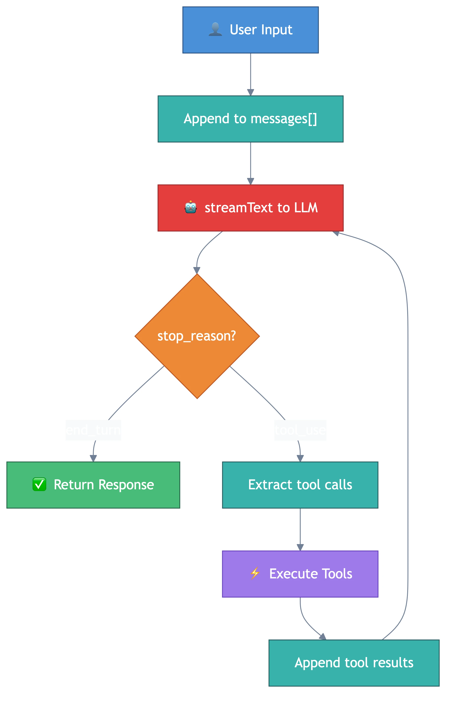 |
| [S02](docs/zh/s02-tool-system.md) | 工具系统 | `tool/` | "每个工具都是一个 `define()` 调用" | 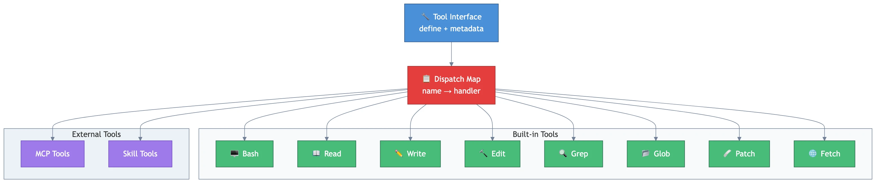 |
| [S03](docs/zh/s03-provider-system.md) | Provider 系统 | `provider/` | "20+ 供应商，一个 `streamText()`" | 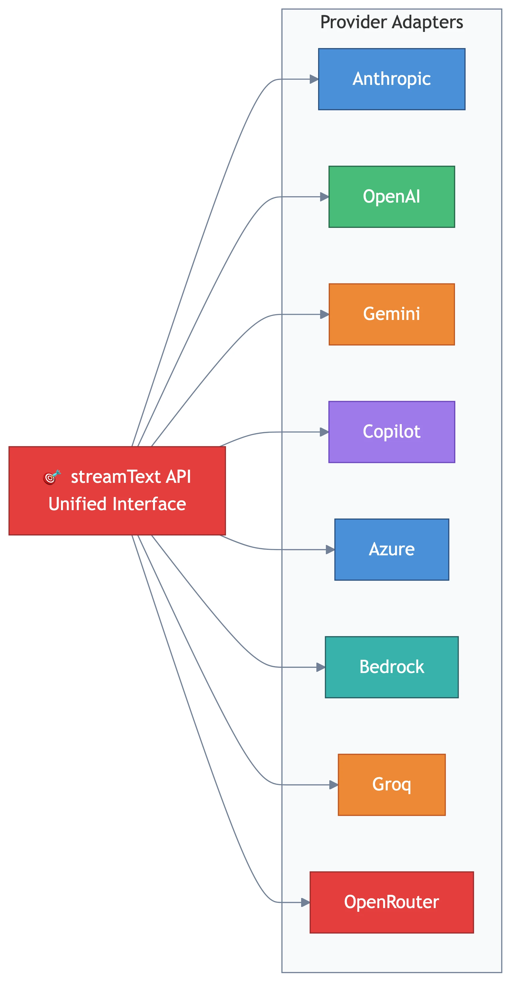 |
| [S04](docs/zh/s04-session-management.md) | 会话管理 | `session/` | "对话即数据库行" | 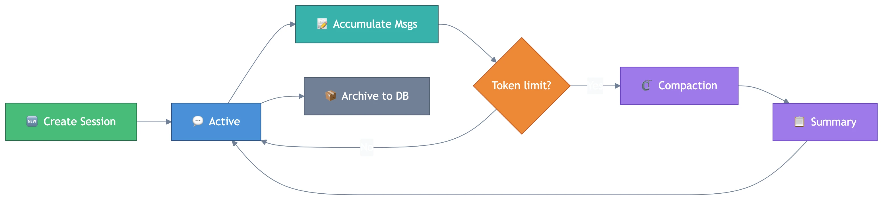 |
| [S05](docs/zh/s05-permission-system.md) | 权限系统 | `permission/` | "通配符规则，分层合并" | 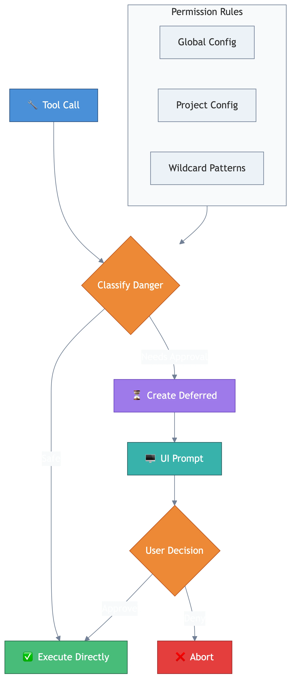 |
| [S06](docs/zh/s06-prompt-engineering.md) | 提示词工程 | `session/prompt/`, `agent/prompt/` | "每个模型一套人格" | 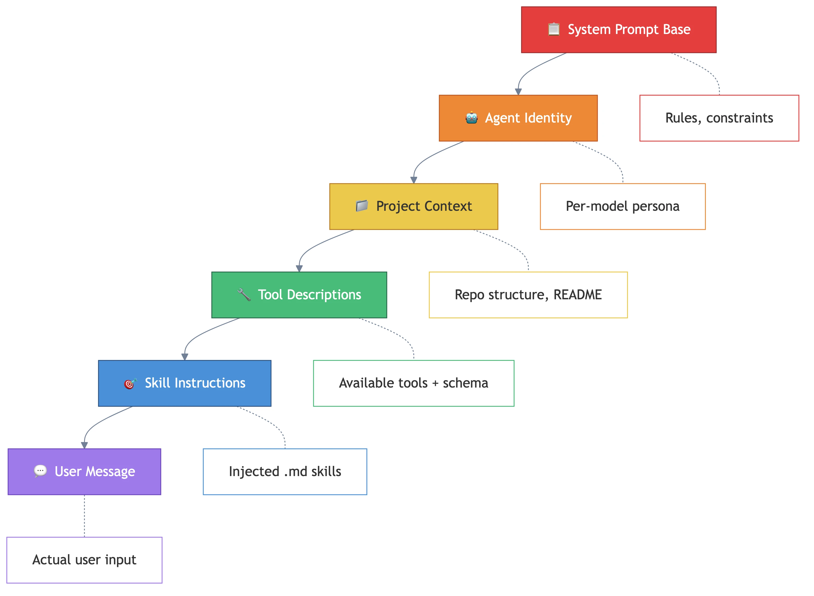 |
| [S07](docs/zh/s07-skill-system.md) | Skill 系统 | `skill/` | "Markdown 即能力" | 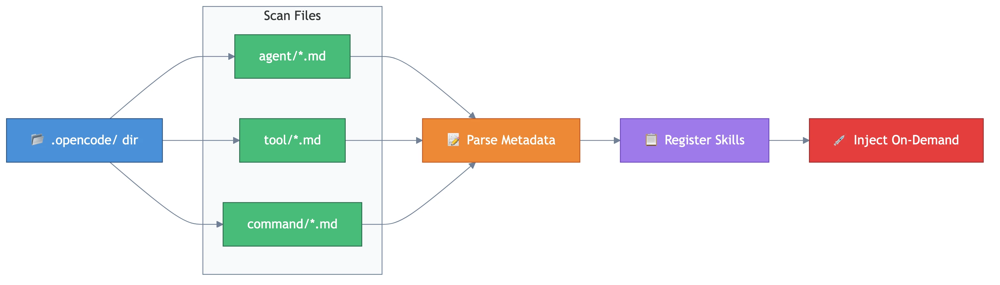 |
| [S08](docs/zh/s08-mcp-integration.md) | MCP 集成 | `mcp/` | "协议即互操作" | 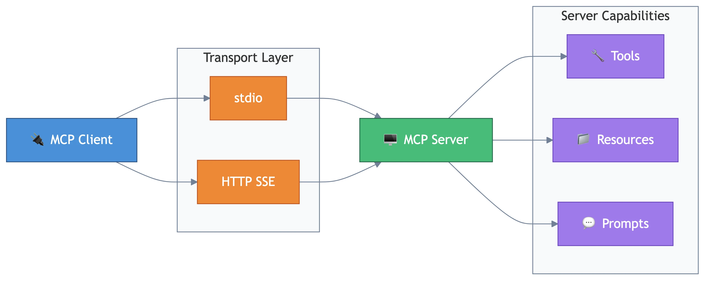 |
| [S09](docs/zh/s09-lsp-integration.md) | LSP 集成 | `lsp/` | "编辑器智能，终端享用" | 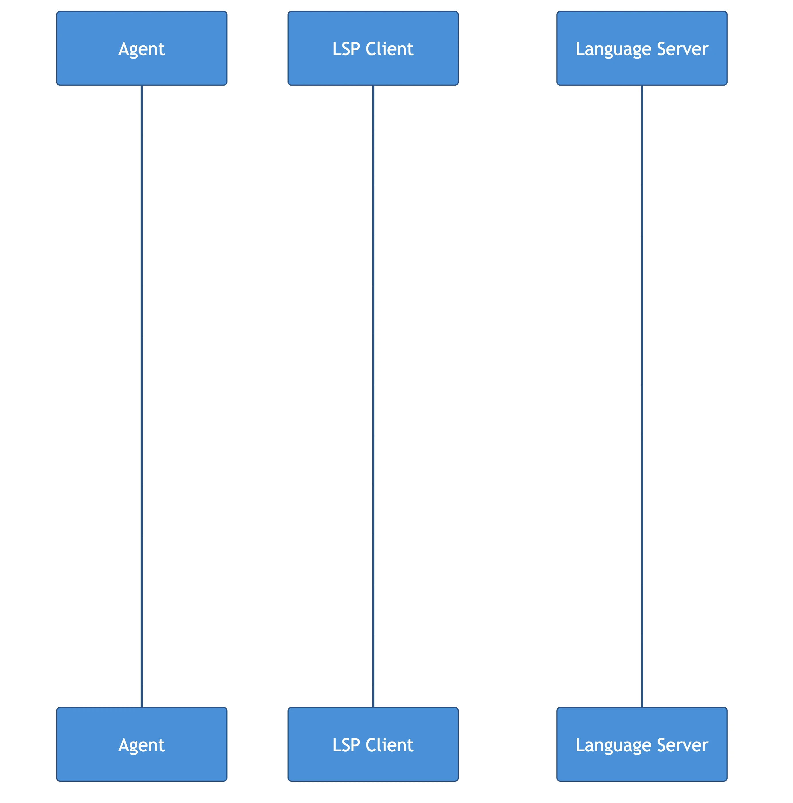 |
| [S10](docs/zh/s10-plugin-system.md) | 插件系统 | `plugin/` | "钩子驱动，无限扩展" | 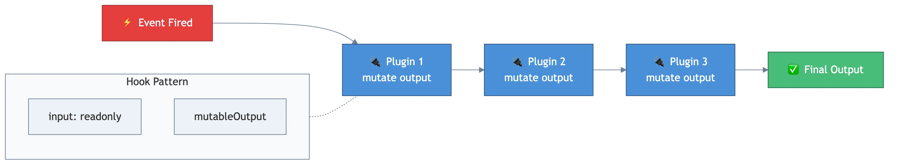 |
| [S11](docs/zh/s11-snapshot-worktree.md) | 快照与工作树 | `snapshot/`, `worktree/` | "大胆修改，随时回滚" | 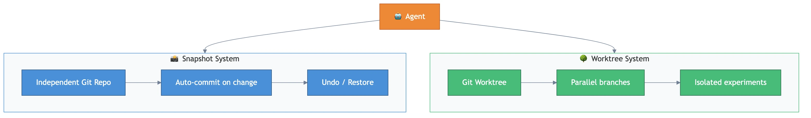 |
| [S12](docs/zh/s12-client-server.md) | 客户端/服务端 | `server/`, `bus/` | "CLI 只是客户端之一" | 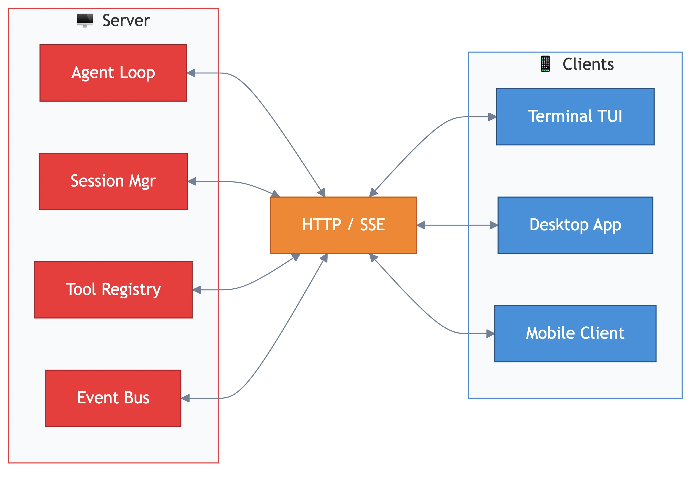 |

---

## 🗺️ 学习路径

```
基础层                  核心层                  高级层
┌──────┐              ┌──────┐              ┌──────┐
│ S01  │──────────────▶│ S05  │──────────────▶│ S08  │
│Agent │              │权限  │              │ MCP  │
│ 循环 │              │系统  │              │ 集成 │
└──┬───┘              └──┬───┘              └──┬───┘
   │                     │                     │
┌──▼───┐              ┌──▼───┐              ┌──▼───┐
│ S02  │──────────────▶│ S06  │──────────────▶│ S09  │
│工具  │              │提示词│              │ LSP  │
│ 系统 │              │ 工程 │              │ 集成 │
└──┬───┘              └──┬───┘              └──┬───┘
   │                     │                     │
┌──▼───┐              ┌──▼───┐              ┌──▼───┐
│ S03  │──────────────▶│ S07  │──────────────▶│ S10  │
│供应商│              │Skill │              │ 插件 │
│ 系统 │              │ 系统 │              │ 系统 │
└──┬───┘              └──┬───┘              └──┬───┘
   │                     │                     │
┌──▼───┐              ┌──▼───┐              ┌──▼───┐
│ S04  │              │ S11  │              │ S12  │
│会话  │              │快照/ │              │C/S   │
│ 管理 │              │工作树│              │ 架构 │
└──────┘              └──────┘              └──────┘
```

---

## ⚡ 快速开始

```bash
# 克隆 OpenCode 源码
git clone https://github.com/anomalyco/opencode.git
cd opencode

# 核心代码位置
ls packages/opencode/src/

# 跟着课程阅读
# 建议从 S01 (Agent 循环) 开始
```

---

## 🔍 OpenCode vs Claude Code

| 维度 | OpenCode | Claude Code |
|------|----------|-------------|
| **开源** | ✅ 完全开源 (MIT) | ❌ 闭源 |
| **模型支持** | 20+ 供应商 (Anthropic, OpenAI, Gemini, Copilot...) | 仅 Claude |
| **架构** | Effect-TS + Vercel AI SDK | 未知（闭源） |
| **工具系统** | `Tool.define()` 统一接口 | 内置工具 |
| **权限模型** | 通配符规则 + 分层合并 | 基于操作类型 |
| **扩展性** | Plugin hooks + MCP + 自定义工具 | MCP |
| **会话存储** | SQLite (Drizzle ORM) | 本地文件 |
| **客户端** | CLI + Desktop + Web | CLI |
| **子 Agent** | `task` 工具 → 子会话 | 无原生支持 |
| **代码回滚** | Git snapshot 系统 | Checkpoint |
| **并行执行** | Git worktree 隔离 | 无 |

---

## 📁 项目结构

```
learn-open-code/
├── README.md               # English README
├── README-zh.md            # 中文 README（主文档）
├── .gitignore
├── LICENSE
└── docs/
    ├── zh/                 # 中文文档（最详尽）
    │   ├── s01-agent-loop.md
    │   ├── s02-tool-system.md
    │   ├── s03-provider-system.md
    │   ├── s04-session-management.md
    │   ├── s05-permission-system.md
    │   ├── s06-prompt-engineering.md
    │   ├── s07-skill-system.md
    │   ├── s08-mcp-integration.md
    │   ├── s09-lsp-integration.md
    │   ├── s10-plugin-system.md
    │   ├── s11-snapshot-worktree.md
    │   └── s12-client-server.md
    └── en/                 # English docs
        └── (same structure)
```

---

## 🙏 致谢

- [OpenCode](https://github.com/anomalyco/opencode) — 本项目分析的目标
- [learn-claude-code](https://github.com/shareAI-lab/learn-claude-code) — 灵感来源
- [Vercel AI SDK](https://sdk.vercel.ai) — OpenCode 的 LLM 调用层
- [Effect-TS](https://effect.website) — OpenCode 的核心架构框架

---

## ⭐ Star History

如果这个项目对你有帮助，请给我们一个 Star！

---

**License:** MIT
