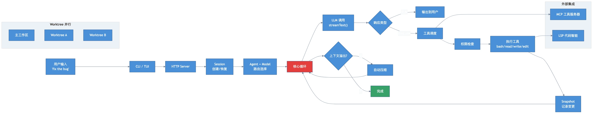

[English](./README.md) | [中文](./README-zh.md)

# 📖 Inside OpenCode: Following One Request from Input to Output

> Not API docs — a journey. We trace `"fix the bug in auth.ts"` through the entire OpenCode system.

## Architecture Overview



```
User types: "fix the bug in auth.ts"
  → ch01: CLI receives input, creates session
  → ch02: Agent + Provider selected, model resolved
  → ch03: Core loop: message → LLM → stop_reason → tool/text
  → ch04: LLM says tool_use, dispatch to bash/read/write/edit
  → ch05: Before bash runs, user must approve
  → ch06: Context overflow → auto-compaction
  → ch07: System prompt assembled from layers
  → ch08: MCP external tools + LSP code intelligence
  → ch09: Something went wrong → undo with snapshots
  → ch10: Why it's a server, not just a CLI
```

## Chapters

| Ch | Topic | Key Question |
|----|-------|-------------|
| [01](./docs/en/ch01-entry-point.md) | Entry: CLI → Session | How does user input become a session? |
| [02](./docs/en/ch02-routing.md) | Routing: Agent + Provider | Who handles it? Which model? |
| [03](./docs/en/ch03-core-loop.md) | Core Loop | What happens inside while(true)? |
| [04](./docs/en/ch04-tools.md) | Tool Dispatch | What happens after tool_use? |
| [05](./docs/en/ch05-permissions.md) | Permissions | How is safety enforced? |
| [06](./docs/en/ch06-compaction.md) | Context Management | What if the conversation is too long? |
| [07](./docs/en/ch07-prompts-skills.md) | Prompts + Skills | How is the system prompt assembled? |
| [08](./docs/en/ch08-mcp-lsp.md) | MCP + LSP | How to extend tools and code intelligence? |
| [09](./docs/en/ch09-snapshots.md) | Snapshots & Undo | What if something goes wrong? |
| [10](./docs/en/ch10-architecture.md) | Architecture: Worktree + C/S | Why this architecture? |

## How to Read

- **Sequential**: each chapter picks up where the previous one left off
- **With source code**: every snippet includes file paths
- **Focus on "Key Insights"**: the summary at the end of each chapter is the gold

## Source

Based on [OpenCode](https://github.com/nicepkg/opencode) source analysis.

## License

MIT
