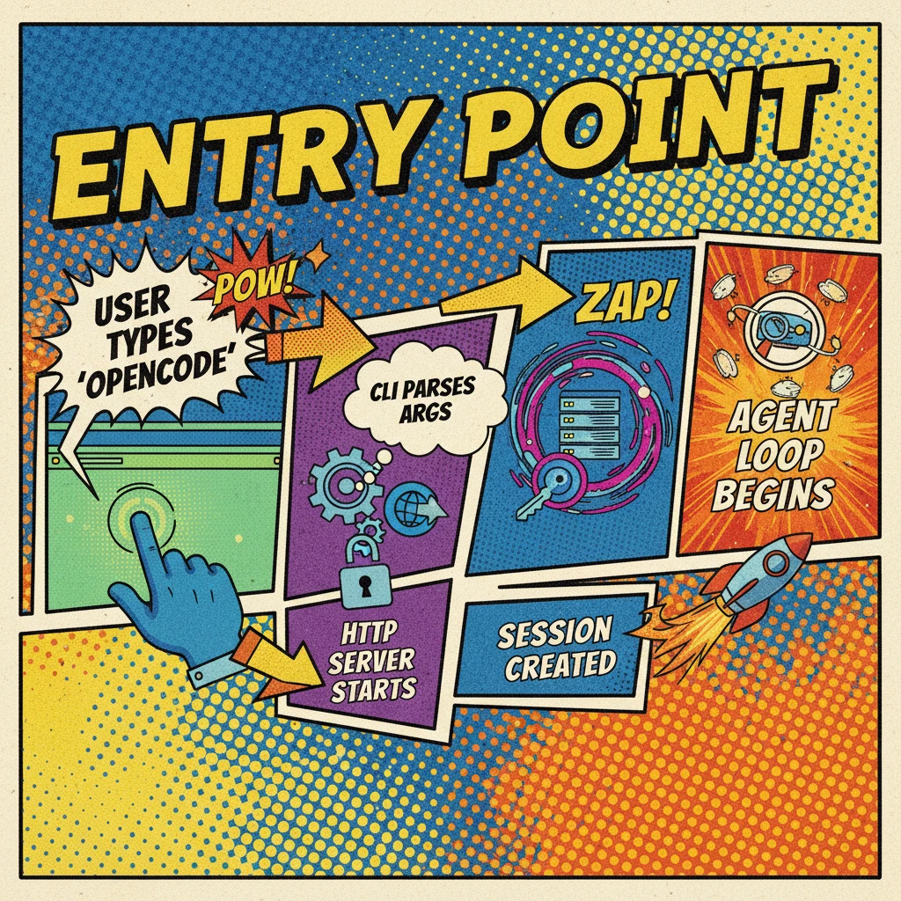

# Chapter 1: Entry Point — From CLI to Session

> **Motto**: Every conversation begins with a session.

## Starting Point

User types: `opencode run "fix the bug in auth.ts"`

## Code Path

### CLI Entry: RunCommand

```typescript
// src/cli/cmd/run.ts:L308
export const RunCommand = cmd({
  command: "run [message..]",
  handler: async (args) => {
    await bootstrap(process.cwd(), async () => {
      // Key: CLI starts an embedded HTTP server, then talks to it via SDK
      const fetchFn = async (input, init) => Server.Default().fetch(new Request(input, init))
      const sdk = createOpencodeClient({ baseUrl: "http://opencode.internal", fetch: fetchFn })
      await execute(sdk)
    })
  },
})
```

### Creating a Session

```typescript
// src/session/index.ts:L162
const result: Info = {
  id: SessionID.descending(),
  slug: Slug.create(),
  projectID: Instance.project.id,
  directory: input.directory,
  title: input.title ?? createDefaultTitle(),
  time: { created: Date.now(), updated: Date.now() },
}
```

Session is a SQLite row — the anchor for all messages, tool calls, and permissions.

### Sending the User Message

```typescript
// src/session/prompt.ts:L84
export const prompt = fn(PromptInput, async (input) => {
  const message = await createUserMessage(input)  // Store user msg with agent + model info
  return loop({ sessionID: input.sessionID })       // Start the main loop
})
```

## Diagram



## Key Insights

1. **CLI is a Server client**: `opencode run` goes through the embedded HTTP API
2. **Session is the anchor**: all data hangs off a Session ID
3. **User message carries routing info**: `agent` and `model` fields determine what happens next

## Next: How Agent and Provider are selected → [Chapter 2](./ch02-routing.md)

---

[下一章：Chapter 2: Routing](./ch02-routing.md) →
