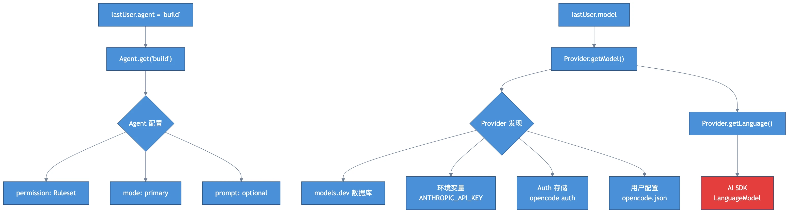

# Chapter 2: Routing — Agent & Provider Selection

> **Motto**: Choose the right model, win half the battle.

## Where We Left Off

User message created with `agent: "build"` and `model: { providerID: "anthropic", modelID: "claude-sonnet-4" }`.

## Code Path

### Agent Resolution

Agents are static config objects, not runtime instances:

```typescript
// src/agent/agent.ts:L65
const agents = {
  build: { permission: [...], mode: "primary" },    // Default, full tool access
  plan: { permission: [...edit: deny], mode: "primary" },  // Read-only
  explore: { permission: [..., grep/read only], mode: "subagent" },
}
```

### Provider Discovery

Providers aggregate from 4 sources (lowest to highest priority):
1. **models.dev database** — built-in model catalog
2. **Environment variables** — `ANTHROPIC_API_KEY`, etc.
3. **Auth storage** — `opencode auth` saved credentials
4. **User config** — `opencode.json` provider field

20+ AI SDK providers are bundled: Anthropic, OpenAI, Google, AWS Bedrock, Azure, etc.

### Model Resolution

```typescript
// src/provider/provider.ts
export async function defaultModel() {
  if (cfg.model) return parseModel(cfg.model)           // User config
  const recent = await readRecentModels()                // Recently used
  const provider = Object.values(providers).find(...)    // Auto-detect
  const [model] = sort(Object.values(provider.models))   // Priority: gpt-5 > claude-sonnet-4 > gemini
}
```

## Diagram



## Key Insights

1. **Agent = permissions + prompt container** — decides which tools LLM can use
2. **Provider aggregation** — env vars, auth, config, all merged
3. **Smart model fallback** — user > config > recent > auto-detect

## Next: The core loop runs → [Chapter 3](./ch03-core-loop.md)
