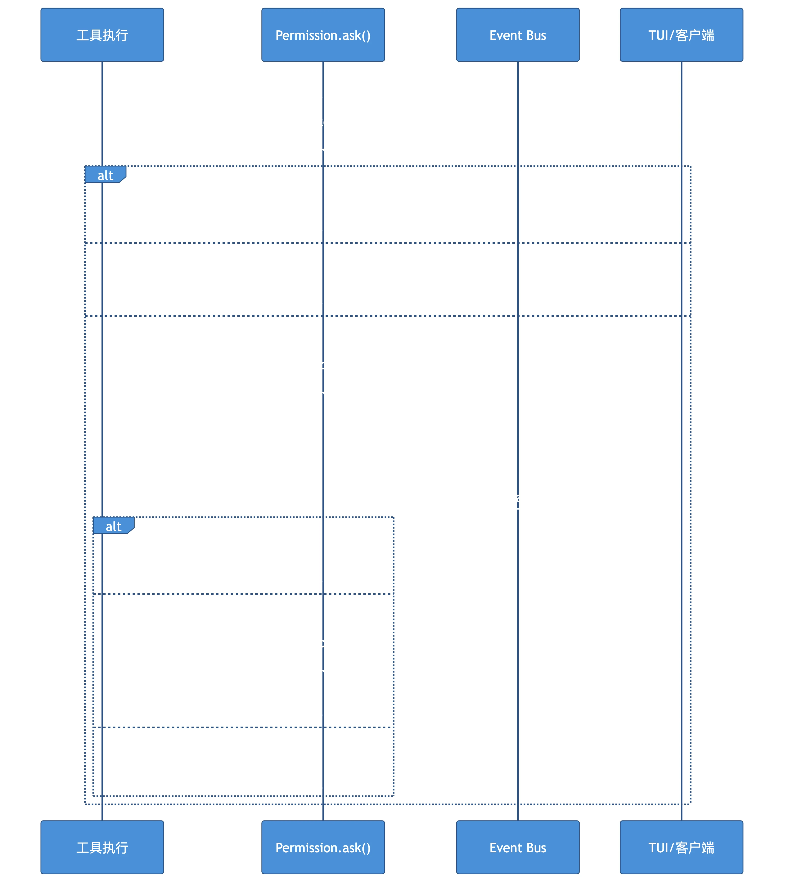

# Chapter 5: Permissions — User Approval for Tool Calls

> **Motto**: Trust is layered, and so are permissions.

## Where We Left Off

bash tool called `ctx.ask({ permission: "bash", patterns: [command] })`.

## Code Path

### Permission.ask() — The Core

```typescript
// src/permission/index.ts:L126
for (const pattern of request.patterns) {
  const rule = evaluate(request.permission, pattern, ruleset, approved)
  if (rule.action === "deny") return new DeniedError()
  if (rule.action === "allow") continue
  needsAsk = true
}
if (!needsAsk) return  // All allowed

// Need user confirmation — block with Deferred
const deferred = Deferred.make()
pending.set(id, { info, deferred })
Bus.publish(Event.Asked, info)      // Notify TUI via SSE
return Deferred.await(deferred)     // Block until user replies
```

### Rule Evaluation: findLast semantics

```typescript
// src/permission/evaluate.ts
const match = rules.findLast(
  (rule) => Wildcard.match(permission, rule.permission) && Wildcard.match(pattern, rule.pattern),
)
```

Later rules override earlier ones. Sources (low → high priority): Agent defaults → User config → Session runtime.

### Three Reply Types

- **once**: allow this one call
- **always**: add pattern to approved list (cascading — auto-approves matching pending requests)
- **reject**: reject this + all pending requests in same session

### Doom Loop Detection

```typescript
// src/session/processor.ts:L119
// If same tool called 3 times with identical input → ask user to intervene
if (recentParts.length === 3 && allSameToolAndInput) {
  permission.ask({ permission: "doom_loop", ... })
}
```

## Diagram



## Key Insights

1. **Deferred for async approval**: tool execution pauses until user responds
2. **findLast semantics**: later rules override earlier ones
3. **"always" cascades**: approving one pattern auto-approves all matching pending requests
4. **"reject" is broad**: rejects all pending requests in the session

## Next: Context management → [Chapter 6](./ch06-compaction.md)
