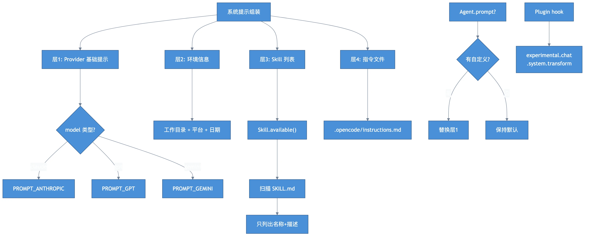

# Chapter 7: Prompt Assembly — System Prompts & Skills

> **Motto**: Good prompts are layered, like an onion.

## Where We Left Off

Compaction keeps context under limits. Now let's look at how the system prompt is assembled.

## Code Path

### Three-layer Structure

```typescript
// src/session/prompt.ts (loop)
const system = [
  ...await SystemPrompt.environment(model),  // Layer 1: env info
  ...(skills ? [skills] : []),                // Layer 2: skill list
  ...await InstructionPrompt.system(),        // Layer 3: .opencode/instructions.md
]
```

### Layer 1: Provider-specific Base Prompt + Environment

Different models get different base prompts (`PROMPT_ANTHROPIC`, `PROMPT_GPT`, `PROMPT_GEMINI`). Environment info includes working directory, platform, git status, date.

### Layer 2: Skills (Lazy-loaded)

```typescript
// src/session/system.ts
const list = await Skill.available(agent)
// Only names + descriptions listed in system prompt
// Full content loaded when LLM calls the "skill" tool
```

Skills discovered from: `.opencode/skills/`, `.claude/skills/`, `~/.opencode/skills/`, config dirs.

### Layer 3: Instruction Files

`.opencode/instructions.md` (project) and `~/.opencode/instructions.md` (global).

### Agent Override

If an agent has a custom `prompt`, it **replaces** (not appends to) the provider base prompt.

## Diagram



## Key Insights

1. **Layered assembly**: provider base → environment → skills → instructions → agent override
2. **Skills are lazy**: system prompt lists them, `skill` tool loads content
3. **Plugin hook**: `experimental.chat.system.transform` lets plugins modify the final prompt
4. **Cache-friendly**: stable parts first for Anthropic prompt caching

## Next: MCP + LSP → [Chapter 8](./ch08-mcp-lsp.md)
