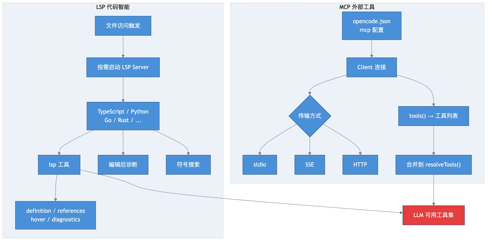

# Chapter 8: External Integration — MCP & LSP

> **Motto**: One goes fast, many go far.

## Where We Left Off

System prompt assembled. The tool set includes both built-in and MCP tools.

## MCP: External Tool Servers

Configure in `opencode.json`:
```json
{ "mcp": { "my-server": { "type": "stdio", "command": "npx", "args": ["-y", "@my/server"] } } }
```

Three transport types: **stdio** (subprocess), **SSE**, **HTTP**. Tools discovered automatically and merged into `resolveTools()`. All MCP tools require user approval by default.

## LSP: Code Intelligence

- **Auto-detected**: LSP servers start on first file access for matching extensions
- **Built-in support**: TypeScript, Python, Go, Rust, and more
- **Integration points**:
  - `lsp` tool: definition, references, hover, diagnostics
  - File attachment: symbol range resolution
  - Post-edit diagnostics

## Diagram



## Key Insights

1. **MCP extends tools**: external tools are indistinguishable from built-in ones to the LLM
2. **LSP is passive**: integrates via the lsp tool and diagnostics, not directly in the loop
3. **On-demand startup**: LSP servers only start when needed
4. **MCP requires approval**: all MCP tool calls need user confirmation unless configured otherwise

## Next: Snapshots & undo → [Chapter 9](./ch09-snapshots.md)

---

← [上一章：Chapter 7: Prompt Assembly](./ch07-prompts-skills.md) | [下一章：Chapter 9: Snapshots & Undo](./ch09-snapshots.md) →
