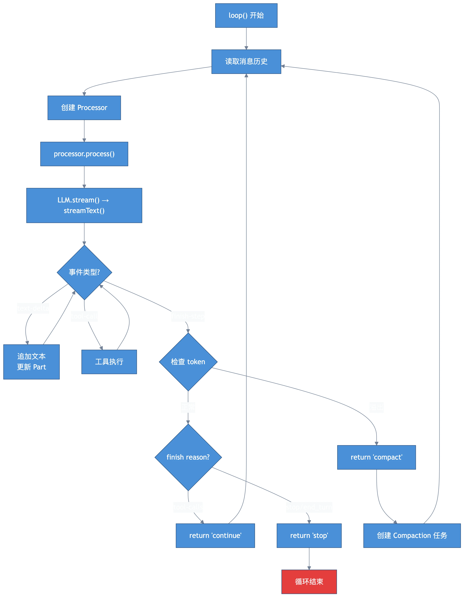

# 第三章：核心循环 —— 消息、LLM、停止原因

> **格言**：一个 while(true) 撑起了整个 AI 编程助手。

## 上回说到

Agent（`build`）和 Model（如 `claude-sonnet-4`）已确定。`SessionPrompt.loop()` 的 while 循环即将执行它的核心逻辑。

## 代码路径

### 1. 创建 Processor

每一轮循环的核心是创建一个 `SessionProcessor`：

```typescript
// src/session/prompt.ts（loop 内部）
const processor = await SessionProcessor.create({
  assistantMessage: await Session.updateMessage({
    id: MessageID.ascending(),
    role: "assistant",
    parentID: lastUser.id,
    agent: agent.name,
    modelID: model.id,
    providerID: model.providerID,
    sessionID,
    cost: 0,
    tokens: { input: 0, output: 0, reasoning: 0, cache: { read: 0, write: 0 } },
    time: { created: Date.now() },
  }),
  sessionID,
  model,
  abort,
})
```

注意：**先创建空的 assistant message 写入数据库**，再开始流式处理。这样 TUI 能立刻看到"助手正在回复"。

### 2. 构建 LLM 输入

Processor 拿到后，调用它的 `process` 方法，传入完整的 LLM 输入：

```typescript
// src/session/prompt.ts（loop 内部）
const result = await processor.process({
  user: lastUser,
  agent,
  permission: session.permission,
  abort,
  sessionID,
  system,                    // 系统提示（第七章详述）
  messages: modelMessages,   // 历史消息转换为 AI SDK 格式
  tools,                     // 解析后的工具集（第四章详述）
  model,
})
```

### 3. 流式调用 LLM

`processor.process()` 内部调用 `llm.stream()`：

```typescript
// src/session/processor.ts:L184（process 函数）
const stream = llm.stream(streamInput)

yield* stream.pipe(
  Stream.tap((event) =>
    Effect.gen(function* () {
      input.abort.throwIfAborted()
      yield* handleEvent(event)
    }),
  ),
  Stream.takeUntil(() => ctx.needsCompaction),
  Stream.runDrain,
)
```

`LLM.stream()` 最终调用 Vercel AI SDK 的 `streamText()`：

```typescript
// src/session/llm.ts:L120
return streamText({
  temperature: params.temperature,
  tools,
  toolChoice: input.toolChoice,
  maxOutputTokens,
  abortSignal: input.abort,
  messages,
  model: wrapLanguageModel({ model: language, middleware: [...] }),
})
```

### 4. 事件处理：handleEvent

流返回的每个事件都由 `handleEvent` 处理。关键事件类型：

```typescript
// src/session/processor.ts:L76（handleEvent 函数）
switch (value.type) {
  case "text-start":
    // 创建新的文本 part
    ctx.currentText = { id: PartID.ascending(), type: "text", text: "" }
    yield* session.updatePart(ctx.currentText)
    break

  case "text-delta":
    // 追加文本增量，发送 delta 事件给 TUI
    ctx.currentText.text += value.text
    yield* session.updatePartDelta({ delta: value.text })
    break

  case "tool-call":
    // LLM 请求调用一个工具 —— 下一章的主题
    ctx.toolcalls[value.toolCallId].state = { status: "running", input: value.input }
    break

  case "tool-result":
    // 工具执行完毕，结果回传
    yield* session.updatePart({ ...match, state: { status: "completed", output: value.output.output } })
    break

  case "finish-step":
    // 一个 step 结束（可能有多个 step：文本 → 工具 → 文本 → ...）
    const usage = Session.getUsage({ model, usage: value.usage })
    ctx.assistantMessage.cost += usage.cost
    // 检查是否需要压缩
    if (isOverflow({ tokens: usage.tokens, model })) {
      ctx.needsCompaction = true
    }
    break
}
```

### 5. 循环决策：continue / stop / compact

`process()` 返回三种结果：

```typescript
// src/session/processor.ts:L230
if (input.abort.aborted && !ctx.assistantMessage.error) yield* abort()
if (ctx.needsCompaction) return "compact"
if (ctx.blocked || ctx.assistantMessage.error || input.abort.aborted) return "stop"
return "continue"
```

回到 `loop()` 中：

```typescript
// src/session/prompt.ts（loop 内部）
if (result === "stop") break
if (result === "compact") {
  await SessionCompaction.create({ sessionID, agent, model, auto: true })
  continue  // 回到循环顶部，执行压缩
}
continue  // "continue" → 回到循环顶部，处理工具结果
```

**为什么 "continue" 要回到循环顶部？** 因为 AI SDK 的 `streamText` 会在 tool_use 后自动执行工具并回传结果，但 OpenCode 选择了**手动管理循环**——每次工具调用完成后，重新从数据库读取消息历史，重新组装上下文，再次调用 LLM。

### 6. 循环退出条件

```typescript
// src/session/prompt.ts（loop 内部）
if (
  lastAssistant?.finish &&
  !["tool-calls"].includes(lastAssistant.finish) &&
  lastUser.id < lastAssistant.id
) {
  break  // LLM 说"我说完了"，循环结束
}
```

`finish` 为 `"stop"` 或 `"end_turn"` 表示 LLM 认为任务完成。`"tool-calls"` 表示还有工具要执行。

## 架构图



## 关键洞察

1. **每个 step 独立流式处理**：一次 LLM 调用可能产生文本+多个工具调用，每个都是独立的 part
2. **循环在 prompt.ts，不在 processor.ts**：Processor 只处理一次 LLM 调用，loop 决定是否继续
3. **三种退出信号**：`stop`（完成/错误/中止）、`compact`（上下文溢出）、`continue`（工具调用后继续）
4. **数据库是 Single Source of Truth**：每次循环都从数据库重新读取消息，确保一致性

## 下一章预告

当 LLM 返回 `tool_use` 事件时，具体的工具是如何被发现、注册和执行的？

---

← [上一章：第二章：路由](./ch02-routing.md) | [下一章：第四章：工具调度](./ch04-tools.md) →
