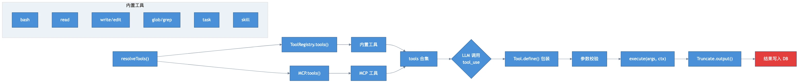

# 第四章：工具调度 —— bash、read、write、edit 的执行

> **格言**：LLM 是大脑，工具是双手。

## 上回说到

核心循环正在运行。LLM 的流式响应中出现了 `tool-call` 事件——它想调用 `bash` 执行一条命令。工具是如何注册和执行的？

## 代码路径

### 1. 工具注册：ToolRegistry

在循环开始前，`resolveTools()` 收集所有可用工具：

```typescript
// src/session/prompt.ts:L380（resolveTools 函数）
for (const item of await ToolRegistry.tools(
  { modelID, providerID },
  input.agent,
)) {
  tools[item.id] = tool({
    description: item.description,
    inputSchema: jsonSchema(schema),
    async execute(args, options) {
      const ctx = context(args, options)
      await Plugin.trigger("tool.execute.before", { tool: item.id }, { args })
      const result = await item.execute(args, ctx)
      await Plugin.trigger("tool.execute.after", { tool: item.id, args }, result)
      return result
    },
  })
}
```

`ToolRegistry.tools()` 返回所有内置工具的初始化结果。每个工具使用 `Tool.define()` 定义：

### 2. 工具定义模式

```typescript
// src/tool/tool.ts:L38
export function define<Parameters, Result>(
  id: string,
  init: Info["init"],
): Info {
  return {
    id,
    init: async (initCtx) => {
      const toolInfo = init instanceof Function ? await init(initCtx) : init
      const execute = toolInfo.execute
      toolInfo.execute = async (args, ctx) => {
        // 参数校验
        toolInfo.parameters.parse(args)
        const result = await execute(args, ctx)
        // 自动截断过长输出
        const truncated = await Truncate.output(result.output, {}, initCtx?.agent)
        return { ...result, output: truncated.content }
      }
      return toolInfo
    },
  }
}
```

每个工具都经过包装：**参数校验 → 执行 → 输出截断**。

### 3. 内置工具一览

OpenCode 内置了约 15 个工具：

| 工具 | 文件 | 用途 |
|------|------|------|
| `bash` | `src/tool/bash.ts` | 执行 shell 命令 |
| `read` | `src/tool/read.ts` | 读取文件 |
| `write` | `src/tool/write.ts` | 写入文件 |
| `edit` | `src/tool/edit.ts` | 精确编辑文件（搜索/替换） |
| `multiedit` | `src/tool/multiedit.ts` | 多处编辑 |
| `glob` | `src/tool/glob.ts` | 文件名模式匹配 |
| `grep` | `src/tool/grep.ts` | 搜索文件内容 |
| `list` | `src/tool/ls.ts` | 列目录 |
| `task` | `src/tool/task.ts` | 启动子 Agent |
| `skill` | `src/tool/skill.ts` | 加载 Skill |
| `webfetch` | `src/tool/webfetch.ts` | 抓取网页 |
| `websearch` | `src/tool/websearch.ts` | 搜索引擎 |
| `codesearch` | `src/tool/codesearch.ts` | 代码搜索 |
| `lsp` | `src/tool/lsp.ts` | LSP 代码智能 |
| `plan` | `src/tool/plan.ts` | 计划模式控制 |

### 4. 工具执行上下文

每个工具调用都带有丰富的上下文：

```typescript
// src/tool/tool.ts:L12
export type Context = {
  sessionID: SessionID
  messageID: MessageID
  agent: string
  abort: AbortSignal
  callID?: string
  messages: MessageV2.WithParts[]  // 完整对话历史
  metadata(input): void             // 实时更新状态
  ask(input): Promise<void>         // 请求权限（下一章详述）
}
```

`ask()` 是权限系统的入口——当工具需要执行危险操作时，通过它请求用户批准。

### 5. bash 工具示例

`bash` 是最常用的工具之一，让我们看看它的执行细节（概要）：

```typescript
// src/tool/bash.ts（简化）
export const BashTool = Tool.define("bash", async () => ({
  description: "Execute a shell command...",
  parameters: z.object({
    command: z.string(),
    timeout: z.number().optional(),
  }),
  async execute(args, ctx) {
    // 1. 请求权限
    await ctx.ask({
      permission: "bash",
      patterns: [args.command],
      metadata: { command: args.command },
    })

    // 2. 执行命令
    const result = await Shell.execute(args.command, {
      cwd: Instance.directory,
      timeout: args.timeout,
      abort: ctx.abort,
    })

    // 3. 返回结果
    return {
      title: args.command,
      output: result.stdout + result.stderr,
      metadata: { exitCode: result.exitCode },
    }
  },
}))
```

### 6. MCP 工具

除了内置工具，MCP（Model Context Protocol）服务器提供的工具也被合并到工具集中：

```typescript
// src/session/prompt.ts:L420（resolveTools 内部）
for (const [key, item] of Object.entries(await MCP.tools())) {
  // MCP 工具需要特殊处理：权限检查 + 输出格式转换
  item.execute = async (args, opts) => {
    await ctx.ask({ permission: key, patterns: ["*"] })
    const result = await execute(args, opts)
    // 将 MCP 的 content 数组转为 OpenCode 的 output 字符串
    return { output: textParts.join("\n\n"), metadata }
  }
  tools[key] = item
}
```

### 7. 工具结果回传

工具执行完毕后，结果通过 Processor 的 `handleEvent` 保存：

```typescript
// src/session/processor.ts:L130（handleEvent 中 tool-result 分支）
case "tool-result":
  yield* session.updatePart({
    ...match,
    state: {
      status: "completed",
      input: value.input,
      output: value.output.output,
      title: value.output.title,
      time: { start: match.state.time.start, end: Date.now() },
    },
  })
```

结果写入数据库后，下一轮循环会读取它，作为 LLM 的上下文。

## 架构图



## 关键洞察

1. **工具是声明式的**：`Tool.define()` 提供 schema + execute，框架处理校验和截断
2. **两种工具来源**：内置工具（ToolRegistry）和 MCP 工具，在 resolveTools 中合并
3. **工具不知道 LLM**：它们只接收参数和 Context，返回结果。LLM 集成全在 Processor 层
4. **输出自动截断**：`Truncate.output()` 防止工具输出撑爆上下文

## 下一章预告

`bash` 工具调用了 `ctx.ask()` 请求权限。这个权限系统是如何工作的？用户如何批准或拒绝？
