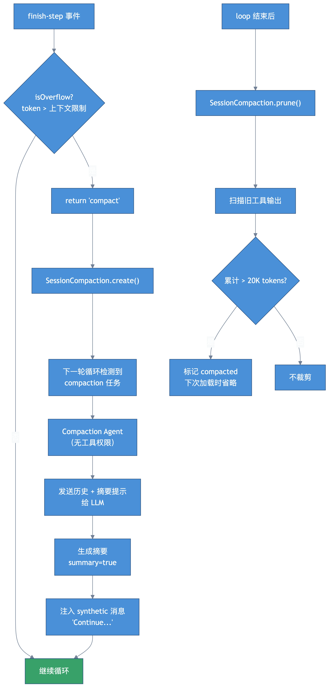

# 第六章：上下文管理 —— 压缩与裁剪

> **格言**：遗忘是为了更好地记忆。

## 上回说到

核心循环在每次 `finish-step` 时检查 token 用量。当接近模型上下文限制时，`ctx.needsCompaction` 被设为 true。

## 代码路径

### 1. 溢出检测

```typescript
// src/session/processor.ts:L187（finish-step 事件处理）
if (
  !ctx.assistantMessage.summary &&
  isOverflow({ cfg: yield* config.get(), tokens: usage.tokens, model: ctx.model })
) {
  ctx.needsCompaction = true
}
```

`isOverflow` 的判断逻辑（`src/session/overflow.ts`）：当输入 token 超过模型上下文窗口的一定比例时触发。

### 2. 触发压缩

`processor.process()` 返回 `"compact"` 后，loop 创建压缩任务：

```typescript
// src/session/prompt.ts（loop 内部）
if (result === "compact") {
  await SessionCompaction.create({
    sessionID,
    agent: lastUser.agent,
    model: lastUser.model,
    auto: true,
    overflow: !processor.message.finish,
  })
  continue  // 回到循环顶部
}
```

### 3. 压缩执行

下一轮循环检测到 compaction 任务，调用 `SessionCompaction.process()`：

```typescript
// src/session/compaction.ts:L75（process 函数，简化）
const processCompaction = Effect.fn("SessionCompaction.process")(function* (input) {
  // 1. 使用 compaction agent（无工具权限的专用 agent）
  const agent = yield* agents.get("compaction")
  const model = yield* Effect.promise(() =>
    agent.model
      ? Provider.getModel(agent.model.providerID, agent.model.modelID)
      : Provider.getModel(userMessage.model.providerID, userMessage.model.modelID),
  )

  // 2. 将所有历史消息发给 LLM，要求生成摘要
  const prompt = `Provide a detailed prompt for continuing our conversation above.
Focus on information that would be helpful for continuing the conversation,
including what we did, what we're doing, which files we're working on,
and what we're going to do next...`

  // 3. 创建 compaction assistant message
  const msg = yield* session.updateMessage({
    role: "assistant",
    mode: "compaction",
    agent: "compaction",
    summary: true,  // 标记为摘要消息
  })

  // 4. 调用 LLM 生成摘要
  const processor = yield* processors.create({ assistantMessage: msg, model, abort })
  const result = yield* processor.process({
    agent,
    tools: {},  // compaction agent 没有工具
    system: [],
    messages: [...modelMessages, { role: "user", content: prompt }],
    model,
  })

  // 5. 如果是 auto 模式，注入 "继续" 指令
  if (result === "continue" && input.auto) {
    const continueMsg = yield* session.updateMessage({ role: "user", ... })
    yield* session.updatePart({
      type: "text",
      synthetic: true,
      text: "Continue if you have next steps, or stop and ask for clarification.",
    })
  }
})
```

压缩完成后，`compacted` 事件触发，循环继续。

### 4. 消息过滤：filterCompacted

循环顶部的 `MessageV2.filterCompacted()` 负责过滤已压缩的消息：

```
原始消息: [user1, assistant1, user2, assistant2(summary=true), user3, assistant3]
过滤后:   [assistant2(summary), user3, assistant3]
```

summary 消息之前的所有消息被丢弃，因为摘要已经包含了必要的上下文。

### 5. 裁剪（Pruning）

压缩是"重新总结"，裁剪是"删掉不重要的部分"。Loop 结束后会调用 prune：

```typescript
// src/session/compaction.ts:L41（prune 函数）
const prune = Effect.fn("SessionCompaction.prune")(function* (input) {
  // 从后往前扫描 tool parts
  let total = 0
  const toPrune: MessageV2.ToolPart[] = []

  loop: for (let msgIndex = msgs.length - 1; msgIndex >= 0; msgIndex--) {
    // 跳过最近 2 轮对话
    if (msg.info.role === "user") turns++
    if (turns < 2) continue

    for (const part of msg.parts.reverse()) {
      if (part.type === "tool" && part.state.status === "completed") {
        if (PRUNE_PROTECTED_TOOLS.includes(part.tool)) continue  // skill 工具不裁剪
        const estimate = Token.estimate(part.state.output)
        total += estimate
        if (total > PRUNE_PROTECT) {  // PRUNE_PROTECT = 40_000 tokens
          toPrune.push(part)
        }
      }
    }
  }

  // 只有累计超过 PRUNE_MINIMUM (20_000 tokens) 才执行
  if (pruned > PRUNE_MINIMUM) {
    for (const part of toPrune) {
      part.state.time.compacted = Date.now()  // 标记为已裁剪
      yield* session.updatePart(part)
    }
  }
})
```

裁剪策略：
- 保留最近 2 轮的所有工具输出
- 保留最近 40K tokens 的工具输出
- 对更早的工具输出，标记 `compacted` 时间戳
- 转换为模型消息时，compacted 的工具输出会被省略

## 架构图



## 关键洞察

1. **两级策略**：先裁剪旧工具输出（便宜），再整体压缩（昂贵但彻底）
2. **压缩使用专用 Agent**：`compaction` agent 没有工具权限，只能生成文本
3. **summary=true 是分水岭**：它之前的所有消息在后续循环中被过滤掉
4. **auto 模式注入 synthetic 消息**：压缩后自动发送 "继续" 指令，用户无感

## 下一章预告

回顾一下：LLM 调用时传入了 `system` 参数。这些系统提示词是怎么组装的？Skill 如何加载？
