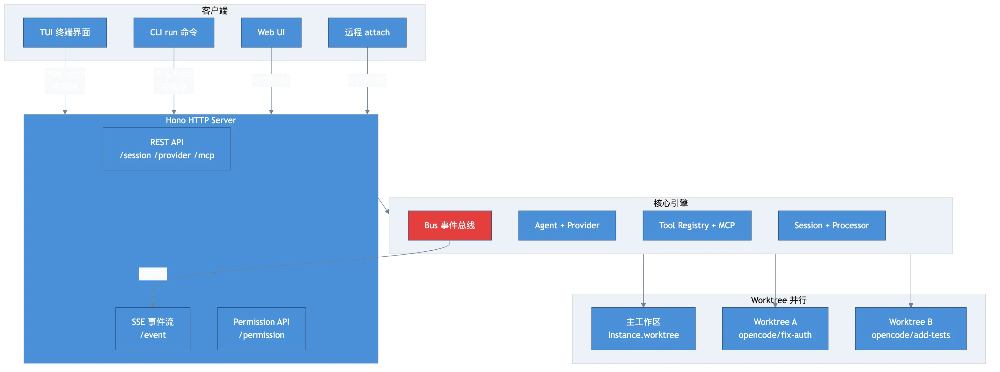

# 第十章：并行与架构 —— Worktree 与 Client/Server

> **格言**：好的架构让复杂变成简单的组合。

## 上回说到

Snapshot 让每个修改可追踪、可撤销。但如果用户想同时处理多个任务呢？如果用户想用 Web UI 替代 TUI 呢？

## Part 1: Worktree —— 并行隔离

### 1. 为什么需要 Worktree

当 LLM 在修改 `auth.ts` 时，你不希望它的改动影响到另一个正在修改 `database.ts` 的任务。Worktree 利用 Git 的 worktree 功能实现物理隔离。

### 2. 创建 Worktree

```typescript
// src/worktree/index.ts:L175
const create = Effect.fn("Worktree.create")(function* (input?: CreateInput) {
  const info = yield* makeWorktreeInfo(input?.name)
  yield* setup(info)    // git worktree add
  yield* boot(info)     // 初始化项目环境
  return info
})
```

`setup` 创建 Git worktree：

```typescript
// src/worktree/index.ts:L160
const setup = Effect.fnUntraced(function* (info: Info) {
  const created = yield* git(
    ["worktree", "add", "--no-checkout", "-b", info.branch, info.directory],
    { cwd: Instance.worktree },
  )
  yield* project.addSandbox(Instance.project.id, info.directory)
})
```

- **分支名**：`opencode/<name>`，如 `opencode/fix-auth`
- **目录**：`~/.opencode/data/worktree/<project-id>/<name>`
- **隔离级别**：完整的文件系统副本，独立的 Git 分支

### 3. 启动脚本

Worktree 创建后，可以执行启动命令（如 `npm install`）：

```typescript
// src/worktree/index.ts:L188
const boot = Effect.fnUntraced(function* (info, startCommand?) {
  yield* git(["reset", "--hard"], { cwd: info.directory })

  // 初始化项目实例（数据库、配置等）
  await Instance.provide({
    directory: info.directory,
    init: InstanceBootstrap,
  })

  // 执行启动脚本
  yield* runStartScripts(info.directory, { projectID, extra: startCommand })
})
```

### 4. 重置和清理

```typescript
// 重置 worktree 到默认分支
const reset = Effect.fn("Worktree.reset")(function* (input) {
  yield* git(["fetch", remote, remoteBranch], { cwd: Instance.worktree })
  yield* git(["reset", "--hard", target], { cwd: worktreePath })
  yield* git(["clean", "-ffdx"], { cwd: worktreePath })
  yield* git(["submodule", "update", "--init", "--recursive"], { cwd: worktreePath })
})

// 删除 worktree
const remove = Effect.fn("Worktree.remove")(function* (input) {
  yield* git(["worktree", "remove", "--force", entry.path], { cwd: Instance.worktree })
  yield* git(["branch", "-D", branch], { cwd: Instance.worktree })
})
```

## Part 2: Client/Server 架构

### 5. 为什么是 Server

回到第一章的发现：`opencode run` 通过内嵌 HTTP 服务器通信。这不是偶然的设计。

```typescript
// src/server/server.ts（简化）
export const ControlPlaneRoutes = (): Hono => {
  const app = new Hono()
  return app
    .use(basicAuth(...))         // 基础认证
    .use(cors({ ... }))          // CORS 支持
    .route("/", GlobalRoutes())  // 全局路由
    .route("/", WorkspaceRouterMiddleware())  // 工作区路由
}
```

Server 的路由覆盖了所有功能：

```
GET  /session             → 列出所有 session
POST /session             → 创建 session
POST /session/:id/prompt  → 发送消息
GET  /event               → SSE 事件流
POST /permission/:id      → 权限回复
GET  /provider             → 列出 provider
GET  /mcp/status           → MCP 状态
POST /worktree             → 创建 worktree
// ... 更多路由
```

### 6. 多客户端

这种架构允许多种客户端：

- **TUI**（内置终端界面）—— 通过内嵌 fetch
- **CLI run 命令** —— 通过内嵌 fetch
- **Web UI** —— 通过 HTTP 连接
- **远程 attach** —— `opencode run --attach http://server:4096`

```typescript
// src/cli/cmd/run.ts:L492
if (args.attach) {
  // 连接远程服务器
  const sdk = createOpencodeClient({ baseUrl: args.attach, headers })
  return await execute(sdk)
}

// 本地内嵌服务器
const fetchFn = async (input, init) => {
  const request = new Request(input, init)
  return Server.Default().fetch(request)
}
const sdk = createOpencodeClient({ baseUrl: "http://opencode.internal", fetch: fetchFn })
```

### 7. 事件流：SSE

TUI 和 CLI 通过 Server-Sent Events 接收实时更新：

```typescript
// src/server/routes/event.ts（简化）
app.get("/event", async (c) => {
  // 返回 SSE 流
  return streamSSE(c, async (stream) => {
    const unsub = Bus.subscribeAll((event) => {
      stream.writeSSE({ data: JSON.stringify(event) })
    })
    // 保持连接直到客户端断开
  })
})
```

### 8. Bus：事件总线

贯穿整个系统的 Bus 是一个进程内的 PubSub：

```typescript
// src/bus/index.ts
// 发布
yield* PubSub.publish(state.wildcard, payload)

// 订阅
Stream.fromPubSub(state.wildcard)
```

所有的状态变化（消息更新、权限请求、Session 状态等）都通过 Bus 广播，SSE 路由将其推送给客户端。

## 架构图



## 关键洞察

1. **Worktree = Git worktree**：利用 Git 的原生功能实现文件系统级隔离
2. **Server-first 架构**：即使是本地 CLI 使用，也走 HTTP API，确保一致性
3. **SSE 是唯一的事件通道**：所有状态变化通过 Bus → SSE → 客户端，没有轮询
4. **内嵌 fetch**：本地模式不走网络，直接内存调用 Hono handler，零延迟

## 全文总结

我们跟踪了一条用户请求 `"fix the bug in auth.ts"` 从头到尾的完整旅程：

```
CLI 接收输入 → 创建 Session → 选择 Agent + Model
→ 核心循环（消息 → LLM → 工具调用 → 权限检查 → 结果回传）
→ 上下文溢出时自动压缩 → 系统提示分层组装
→ MCP 扩展工具 + LSP 代码智能
→ Snapshot 记录每一步变更 → Worktree 并行隔离
→ 整体以 Client/Server 架构运作
```

每一层都是独立的，但通过明确的接口组合在一起。这就是 OpenCode 的设计哲学：**每个模块只做一件事，做好一件事**。

---

← [上一章：第九章：快照与撤销](./ch09-snapshots.md)
